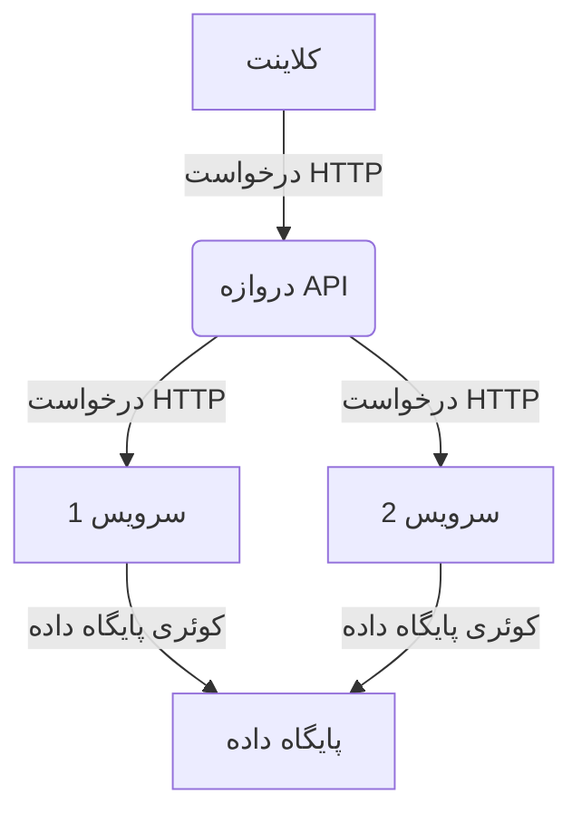

# 🤖 پرامپت‌های ChatGPT برای توسعه‌دهندگان

خوش اومدی به مجموعه شخصی من از پرامپت‌های ChatGPT برای توسعه‌دهندگان! 🙌

این ریپازیتوری شامل فهرستی از پرامپت‌های قدرتمند ChatGPT هست که میتونه به سرعت و خلاقیت شما کمک کنه. 💡 فرقی نمیکنه تازه‌کار باشی یا یه حرفه‌ای باتجربه، این پرامپت‌ها کمکت میکنن خلاقانه‌تر فکر کنی و راه‌حل‌های جدیدی برای مشکلات پیدا کنی. 🚀

این لیست به دسته‌های مختلف تقسیم شده: [پرامپت‌هایی برای برنامه‌نویس‌ها، دانشجوها، بازاریاب‌ها و تولیدکنندگان محتوا]. پس مهم نیست حرفه‌ت چیه، اینجا برای همه چیزی پیدا میشه! 😊 بیا با هم این پرامپت‌های قدرتمند رو بررسی کنیم که میتونن خلاقیت تو رو به سطح بالاتری ببرن! 🌊

## فهرست مطالب

پرامپت‌ها برای برنامه‌نویس‌ها

- [🚩 ترفندهای طلایی پرامپت‌نویسی](#ترفندهای-پرامپت-نویسی)
- [🔗 پرامپت‌های ترکیبی قدرتمند (حلال مشکلات)](#پرامپت-های-ترکیبی)
  - [1. تبدیل کد به استاندارد روز](#1-تبدیل-کد-به-استاندارد-روز)
  - [2. کشف باگ‌های پنهان و حفره‌های امنیتی](#2-کشف-باگ‌های-پنهان-و-حفره‌های-امنیتی)
  - [3. راستی‌آزمایی هوشمند راه‌حل‌ها](#3-راستی‌آزمایی-هوشمند-راه‌حل‌ها)
  - [4. ساخت کد حرفه‌ای](#4-ساخت-کد-حرفه‌ای)
  - [5. نوشتن تست‌های خودکار](#5-نوشتن-تست‌های-خودکار)
- [تبدیل پرامپت‌ها به شاهکار](#تبدیل-پرامپت‌ها-به-شاهکار)
- [بهینه‌سازی پرامپت‌ها با هوش مصنوعی](#بهینه‌سازی-پرامپت‌ها-با-هوش-مصنوعی)
- [یافتن راه‌حل‌های خلاقانه‌تر](#یافتن-راه‌حل‌های-خلاقانه‌تر)
- [مستندسازی حرفه‌ای](#مستندسازی-حرفه‌ای)
  - [📣 ساخت داکیومنت جامع](#ساخت-داکیومنت-جامع)
  - [📣 نوشتن قوانین و شرایط استفاده](#نوشتن-قوانین-و-شرایط-استفاده)
  - [📣 ساخت راهنمای سریع](#ساخت-راهنمای-سریع)
  - [📣 تولید فایل README حرفه‌ای](#تولید-فایل-readme-حرفه‌ای)
  - [📣 نگارش مقاله تخصصی](#نگارش-مقاله-تخصصی)
  - [📣 توضیح ساده کد پیچیده](#توضیح-ساده-کد-پیچیده)
  - [📣 ساخت نمودار معماری](#ساخت-نمودار-معماری)
  - [📣 تولید نمودار ER](#تولید-نمودار-er)
- [متحول‌سازی کد](#متحول‌سازی-کد)
  - [📣 بازسازی کد](#بازسازی-کد)
  - [📣 مدرن‌سازی کد قدیمی](#مدرن‌سازی-کد-قدیمی)
  - [📣 تقسیم کد طولانی](#تقسیم-کد-طولانی)
  - [📣 افزایش سرعت کد](#افزایش-سرعت-کد)
  - [📣 افزودن پارامتر به تابع](#افزودن-پارامتر-به-تابع)
  - [📣 پیاده‌سازی بهترین استانداردها](#پیاده‌سازی-بهترین-استانداردها)
  - [📣 استانداردسازی استایل کد](#استانداردسازی-استایل-کد)
  - [📣 یافتن و حذف باگ‌ها](#یافتن-و-حذف-باگ‌ها)
  - [📣 دیباگ کامپوننت React](#دیباگ-کامپوننت-react)
  - [📣 نوشتن تست‌های واحد](#نوشتن-تست‌های-واحد)
  - [📣 ترجمه کد به زبان دیگر](#ترجمه-کد-به-زبان-دیگر)
  - [📣 پیاده‌سازی طراحی واکنشگرا](#پیاده‌سازی-طراحی-واکنشگرا)
  - [📣 چندزبانه‌سازی کد](#چندزبانه‌سازی-کد)
  - [📣 کامنت‌گذاری کد](#کامنت‌گذاری-کد)
- [تولید کد جدید](#تولید-کد-جدید)
  - [📣 ساخت تابع سفارشی](#ساخت-تابع-سفارشی)
  - [📣 ساخت داکرفایل](#ساخت-داکرفایل)
  - [📣 نوشتن رجکس قدرتمند](#نوشتن-رجکس-قدرتمند)
  - [📣 ساخت کلاس حرفه‌ای](#ساخت-کلاس-حرفه‌ای)
  - [📣 افزودن قابلیت جدید](#افزودن-قابلیت-جدید)
  - [📣 تولید کد پایه](#تولید-کد-پایه)
  - [📣 کمک از مهندس نرم‌افزار سطح جهانی](#کمک-از-مهندس-نرم‌افزار-سطح-جهانی)
- [بررسی کد](#بررسی-کد)
  - [📣 تقویت مدیریت خطای کد](#تقویت-مدیریت-خطای-کد)
  - [📣 دریافت راهکارهای بهبود کد](#دریافت-راهکارهای-بهبود-کد)
- [بازاریابی محصول و خدمات](#بازاریابی-محصول-و-خدمات)
  - [📣 ساخت ایده‌های محصول خلاقانه](#ساخت-ایده‌های-محصول-خلاقانه)
  - [📣 نوشتن ارزش پیشنهادی منحصربفرد](#نوشتن-ارزش-پیشنهادی-منحصربفرد)
  - [📣 داستان‌سرایی تاثیرگذار برای بازاریابی](#داستان‌سرایی-تاثیرگذار-برای-بازاریابی)
  - [📣 طراحی برنامه معرفی موفق](#طراحی-برنامه-معرفی-موفق)
  - [📣 تکنیک‌های آپسل و کراس‌سل](#تکنیک‌های-آپسل-و-کراس‌سل)
  - [📣 ساخت کمپین بازاریابی وایرال](#ساخت-کمپین-بازاریابی-وایرال)
  - [📣 نوشتن معرفی کوتاه و جذاب](#نوشتن-معرفی-کوتاه-و-جذاب)
  - [📣 ساخت برنامه بازاریابی عملی](#ساخت-برنامه-بازاریابی-عملی)
  - [📣 جذب لید با محتوا](#جذب-لید-با-محتوا)

## ترفندهای پرامپت‌ نویسی

مثل خیلی چیزای دیگه تو زندگی، با هوش مصنوعی هرچی بیشتر وقت بذاری، نتیجه بهتری میگیری. وقتی زمینه، دستورالعمل و راهنمایی بیشتری ارائه میدی، معمولاً خروجی‌های دقیق‌تری دریافت میکنی.

چند تا ترفند طلایی برای گرفتن نتایج بهتر:

- **پرامپت‌هات رو تیکه‌تیکه کن:**
  درخواست‌های پیچیده رو به چند مرحله تقسیم کن. پرامپت‌هایی که روی یک هدف مشخص تمرکز دارن معمولاً نتایج بهتری نسبت به پرامپت‌های چندکاره میدن. مثلاً، اول بررسی کد بخواه، بعد با توجه به نتیجه، درخواست بازسازی کن.

- **مثال واضح بده:**
  داده‌های ورودی و خروجی مورد انتظارت رو با مثال نشون بده تا کیفیت و دقت پاسخ‌ها بالاتر بره. 📝

- **شفاف و دقیق باش:**
  راحت و واضح بگو دقیقاً چی میخوای، چه چیزی میدونی، چه چیزی لازمه و چه چیزی نباید شامل بشه. 🔎

- **از هوش مصنوعی بخواه روی پاسخش فکر کنه:**
  تکنیک "بازتاب" به طرز شگفت‌انگیزی دقت هوش مصنوعی رو بالا میبره. کافیه ازش بپرسی "چرا این جواب رو دادی؟" یا بخوای پاسخش رو ارزیابی کنه. 🤔

## پرامپت‌ های ترکیبی

با ترکیب چند پرامپت هوشمندانه میتونی کدت رو به‌روز، بازسازی و بررسی کنی. یه مجموعه پرامپت خوب طراحی شده، هر کدوم یه وظیفه مشخص دارن و قدم به قدم تو رو به نتیجه دلخواهت میرسونن.

### 1. تبدیل کد به استاندارد روز

از هوش مصنوعی بخواه کدت رو با استانداردهای مدرن بازنویسی کنه. این مرحله معمولاً یه خروجی منسجم با سبک مورد نظرت میده، اما گاهی ممکنه خطاهایی هم وارد کنه.

**پرامپت:**

```
لطفاً کد زیر رو بررسی کن و با استانداردهای مدرن برنامه‌نویسی و قالب‌بندی تمیز بازنویسی کن. در این بازنویسی به موارد زیر توجه کن:

1. استفاده از ساختارهای مدرن و به‌روز 
2. استفاده از متدهای پیشرفته کار با مجموعه‌ها
3. قالب‌بندی تمیز با فاصله‌گذاری مناسب
4. نام‌گذاری استاندارد متغیرها طبق قواعد زبان
5. اضافه کردن کامنت‌های توضیحی در بخش‌های پیچیده
6. رعایت اصول DRY (تکرار نکردن کد) و SOLID
7. حذف کدهای اضافی و بهبود کارایی

کد من:
[کد رو اینجا قرار بده]

لطفاً در پایان، توضیح مختصری از تغییرات انجام شده و دلیل بهبود عملکرد یا خوانایی کد بده.
```

### 2. کشف باگ‌های پنهان و حفره‌های امنیتی

بعد از بهینه‌سازی کد، وقتشه مشکلات منطقی یا امنیتی رو پیدا کنیم. در این مرحله فقط بررسی میخوایم، نه بازسازی.

**پرامپت:**

```
لطفاً کد تابع یا متد زیر رو با دقت بررسی کن و تحلیل جامعی از نظر مشکلات منطقی، امنیتی و عملکردی ارائه بده:

1. خطاهای منطقی: شرایط نادرست، حلقه‌های بی‌پایان، مشکلات ترتیب اجرا
2. مسائل امنیتی: آسیب‌پذیری‌های تزریق، مشکلات احراز هویت، نشت داده
3. مدیریت خطا: بررسی نقاط شکست احتمالی و نحوه مدیریت استثناها
4. قابلیت نگهداری: پیچیدگی کد، ساختار و سازماندهی
5. مشکلات داده: مدیریت نادرست انواع داده، اعتبارسنجی ورودی

[کد مورد نظر را اینجا قرار دهید]

لطفاً پاسخت رو به صورت فهرستی از مشکلات با اولویت‌بندی از بحرانی تا کم‌اهمیت ارائه کن و برای هر مشکل:
- توضیح دقیق مشکل
- دلیل اهمیت رفع آن
- راه‌حل پیشنهادی مشخص
- نمونه کد اصلاح شده (در صورت امکان)

همچنین در انتها یک خلاصه کلی از وضعیت کد و مهم‌ترین اقدامات اصلاحی مورد نیاز ارائه بده.
```

### 3. راستی‌آزمایی هوشمند راه‌حل‌ها

حالا وقتشه توصیه‌های دریافت شده رو راستی‌آزمایی کنیم. این تکنیک "بازتاب" کمک میکنه دقت توصیه‌ها بالاتر بره و از خطاهای احتمالی جلوگیری بشه.

**پرامپت:**

```
لطفاً توصیه‌های قبلی خود را با دیدگاه انتقادی بازبینی کن و به این موارد پاسخ بده:

1. آیا در تحلیل‌هایت نکته نادرستی وجود داشت که نیاز به اصلاح دارد؟
3. آیا توصیه‌هایی ارائه کردی که در این زمینه نامناسب یا غیرضروری باشند؟
4. آیا راه‌حل‌های پیشنهادی ممکن است عوارض جانبی یا مشکلات جدیدی ایجاد کنند؟
5. آیا اولویت‌بندی مشکلات به درستی انجام شده یا نیاز به بازنگری دارد؟

لطفاً پاسخ رو با ذکر دلیل و در صورت لزوم ارائه اصلاحات مناسب بیان کن.
```

### 4. ساخت کد حرفه‌ای

حالا با ترکیب نتایج بررسی‌ها و توصیه‌ها، وقتشه کد نهایی رو بسازیم.

**پرامپت:**

```
با توجه به تحلیل و توصیه‌های قبلی، لطفاً کد را بازنویسی کن. در این بازنویسی:

1. تمام مشکلات منطقی و امنیتی شناسایی شده را رفع کن
2. عملکرد و کارایی را بهبود بده
3. خوانایی و قابلیت نگهداری کد را افزایش بده
4. از بهترین شیوه‌ها استفاده کن
5. مدیریت خطای مناسب رو اگر نیازه اضافه کن

لطفاً کد بازنویسی شده را همراه با توضیحات مختصر برای هر بخش از تغییرات ارائه کن تا درک بهتری از اصلاحات انجام شده داشته باشم.
```

### 5. نوشتن تست‌های خودکار

برای اطمینان از عملکرد درست کد، چند تست ساده بسازیم که بتونیم محلی اجرا کنیم.

**پرامپت:**

```
لطفاً برای کد بازنویسی شده، دو تست جامع طراحی کن:

1. تست happy: سناریویی که انتظار داریم کد به درستی کار کند
   - شرایط اولیه و پیش‌نیازها
   - داده‌های ورودی معتبر و مناسب
   - نتیجه مورد انتظار
   - توضیح اینکه چرا این تست باید موفق شود

2. edge case: سناریویی که انتظار داریم کد با خطا مواجه شود
   - شرایط اولیه و پیش‌نیازها
   - داده‌های ورودی نامعتبر یا چالش‌برانگیز
   - نتیجه مورد انتظار (پیام خطا، استثنا، یا رفتار خاص)
   - توضیح اینکه چرا این تست باید شکست بخورد

لطفاً تست‌ها را با استفاده از چارچوب یا روش مناسب برای زبان برنامه‌نویسی مربوطه پیاده‌سازی کن و در صورت امکان، نحوه اجرا و تفسیر نتایج را نیز شرح بده.
```

## تبدیل پرامپت‌ها به شاهکار

گاهی میخوایم پرامپت‌های ساده رو به متن‌های جذاب‌تر و توصیفی‌تر تبدیل کنیم. این کار برای محتواسازی عالیه!

**پرامپت:**

```
[پرامپت ساده خودت]

لطفاً متن زیر را به یک توصیف غنی و جذاب تبدیل کن:

[پرامپت اولیه]

در بازنویسی:
1. از توصیفات حسی و تصویرسازی ذهنی استفاده کن
2. جزئیات دقیق و ملموس اضافه کن
3. از استعاره‌ها و تشبیهات مناسب بهره بگیر
4. لحن متن را متناسب با موضوع تنظیم کن
5. ساختار جملات را متنوع و پویا کن
6. از واژگان غنی و دقیق استفاده کن

هدف نهایی، متنی است که خواننده را کاملاً در فضای موضوع غرق کند.
```

<sup>[⬆️ بازگشت به فهرست مطالب](#فهرست-مطالب)</sup>

## بهینه‌سازی پرامپت‌ها با هوش مصنوعی

گاهی نمیدونیم چطور پرامپت بهتری بنویسیم. از خود هوش مصنوعی کمک بگیریم!

**پرامپت:**

```
من این پرامپت را نوشته‌ام:

[پرامپت فعلی]

لطفاً:
1. چند سؤال کلیدی برای درک بهتر هدف و مخاطب من بپرس
2. بر اساس پاسخ‌های احتمالی، ساختار بهینه‌ای برای پرامپت پیشنهاد بده
3. پرامپت روا با افزودن جزئیات هدفمند، محدودیت‌های مشخص و راهنمایی‌های دقیق بازنویسی کن
4. قالب‌بندی و سازماندهی پرامپت را بهبود بده
5. نسخه نهایی پرامپت را ارائه کن که احتمال دریافت پاسخ‌های دقیق‌تر و مرتبط‌تر را افزایش دهد

هدف: دریافت پاسخی که دقیقاً با نیاز من مطابقت داشته باشد.
```

<sup>[⬆️ بازگشت به فهرست مطالب](#فهرست-مطالب)</sup>

## یافتن راه‌حل‌های خلاقانه‌تر

اگه از راه‌حلی که خودت پیدا کردی راضی نیستی، از هوش مصنوعی بخواه چند روش مختلف بهت پیشنهاد بده.

**پرامپت:**

```
من این مسئله را با کد زیر حل کرده‌ام، اما به دنبال رویکردهای خلاقانه‌تر، کارآمدتر یا خواناتر هستم:

[کد فعلی]

لطفاً:
1. کد فعلی من را تحلیل کن و نقاط قوت و ضعف آن را مشخص کن
2. حداقل سه رویکرد متفاوت برای حل همین مسئله پیشنهاد بده
3. برای هر رویکرد، مزایا و معایب آن را از نظر:
   - کارایی و پیچیدگی زمانی/مکانی
   - خوانایی و قابلیت نگهداری
   - مقیاس‌پذیری
   - سادگی پیاده‌سازی
   توضیح بده
4. کد پیاده‌سازی شده برای بهترین رویکرد را ارائه کن
5. توضیح دهید چرا این رویکرد از روش فعلی من بهتر است

هدف: یافتن راه‌حلی که تعادل مناسبی بین کارایی، خوانایی و قابلیت نگهداری داشته باشد.
```

<sup>[⬆️ بازگشت به فهرست مطالب](#فهرست-مطالب)</sup>

---

## مستندسازی حرفه‌ای

### ساخت داکیومنت جامع

مستندسازی خوب، کلید موفقیت پروژه‌های بزرگه. هوش مصنوعی میتونه توضیحات روشن و جامعی از کدت بسازه.

**پرامپت 1:**

```
من برنامه‌نویسی بلد نیستم و میخوام بفهمم این کد چیکار میکنه. لطفاً طوری برام توضیح بده که یه آدم غیرفنی هم بفهمه. از قالب‌بندی مارک‌داون با بخش‌بندی مناسب استفاده کن و در هر بخش به قسمت‌های مربوطه کد اشاره کن:

[کد رو اینجا قرار بده]
```

**پرامپت 2:**

```
یه مستندات جامع برای [نام فایل/ماژول] بساز که شامل هدف، طراحی و نحوه پیاده‌سازی باشه. مثال‌هایی از نحوه استفاده و نمودارهای مرتبط هم اضافه کن. مستندات باید برای سایر توسعه‌دهنده‌ها قابل فهم باشه و با تغییرات آینده ماژول به‌روز بشه.

[کد رو اینجا قرار بده]
```

<sup>[⬆️ بازگشت به فهرست مطالب](#فهرست-مطالب)</sup>

### نوشتن قوانین و شرایط استفاده

قوانین و شرایط استفاده حرفه‌ای برای محصول یا سرویست بساز.

**پرامپت:**

```
برای وبسایتم که درباره [نام محصول/سرویس] هست، یه متن قوانین و شرایط استفاده حرفه‌ای بنویس.
```

<sup>[⬆️ بازگشت به فهرست مطالب](#فهرست-مطالب)</sup>

### ساخت راهنمای سریع

راهنماهای سریع کاربردی برای کاربرانت بساز.

**پرامپت:**

```
یه راهنمای سریع و کاربردی برای [موضوع مورد نظر] بنویس که نکات کلیدی رو پوشش بده.
```

<sup>[⬆️ بازگشت به فهرست مطالب](#فهرست-مطالب)</sup>

### تولید فایل README حرفه‌ای

فایل README جذاب و کامل برای پروژه‌ت بساز.

**پرامپت:**

```
برای این کد یه فایل README جامع بنویس که شامل دستورالعمل‌های دقیق نصب و راه‌اندازی، توضیح عملکرد کد، و لیستی از مشکلات امنیتی احتمالی باشه:

[کد رو اینجا بذار]
```

<sup>[⬆️ بازگشت به فهرست مطالب](#فهرست-مطالب)</sup>

### نگارش مقاله تخصصی

مقاله‌های تخصصی با کد نمونه برای موضوعات مختلف بنویس.

**پرامپت:**

```
یه مقاله تخصصی درباره نحوه ساخت [پروژه مورد نظر] با استفاده از [فناوری مورد نظر] بنویس. کدهای نمونه و ساختار مناسب هم داشته باشه.
```

<sup>[⬆️ بازگشت به فهرست مطالب](#فهرست-مطالب)</sup>

### توضیح ساده کد پیچیده

کدهای پیچیده رو به زبان ساده توضیح بده.

**پرامپت:**

```
من تازه وارد تیم توسعه بک‌اند شدم و باید بفهمم این کد چطور کار میکنه.
تکنولوژی‌ها: [فناوری‌های مورد استفاده]
لطفاً خط به خط برام توضیح بده:

[کد مورد نظر]
```

<sup>[⬆️ بازگشت به فهرست مطالب](#فهرست-مطالب)</sup>

### ساخت نمودار معماری

نمودارهای معماری برای پروژه‌ت با Mermaid بساز.

**پرامپت:**

```
یه کد Mermaid برای نمودار معماری این سیستم بنویس:
[توضیح سیستم]
```

مثال خروجی:



<sup>[⬆️ بازگشت به فهرست مطالب](#فهرست-مطالب)</sup>

### تولید نمودار ER

نمودارهای رابطه موجودیت (ER) با Mermaid بساز.

**پرامپت:**

```
یه کد Mermaid برای نمودار ER این کلاس‌ها/جداول بنویس:
[کلاس‌ها یا جداول]
```

<sup>[⬆️ بازگشت به فهرست مطالب](#فهرست-مطالب)</sup>

## متحول‌سازی کد

### بازسازی کد

کدت رو بدون تغییر عملکرد، بهتر و خواناتر کن.

**پرامپت:**

```
این کد رو میخوام بازسازی کنی تا خوانایی و نگهداری‌پذیری بهتری داشته باشه، بدون اینکه عملکردش تغییر کنه:

[کد مورد نظر]
```

بازسازی کد یکی از مهم‌ترین فرآیندها در توسعه نرم‌افزاره که کیفیت، خوانایی و نگهداری کد رو بهبود میده. با کمک هوش مصنوعی، این کار خیلی سریع‌تر و دقیق‌تر انجام میشه.

<sup>[⬆️ بازگشت به فهرست مطالب](#فهرست-مطالب)</sup>

### مدرن‌سازی کد قدیمی

کدهای قدیمی رو با استانداردهای جدید به‌روز کن.

**پرامپت:**

```
این کد قدیمی رو با استانداردهای مدرن ES6 به‌روز کن:

[کد قدیمی]
```

<sup>[⬆️ بازگشت به فهرست مطالب](#فهرست-مطالب)</sup>

### تقسیم کد طولانی

کدهای طولانی و پیچیده رو به توابع کوچکتر و مدیریت‌پذیرتر تقسیم کن.

**پرامپت:**

```
این تابع طولانی رو به چند تابع کوچکتر تقسیم کن تا خوانایی و قابلیت نگهداری بهتری داشته باشه:

[کد طولانی]
```

<sup>[⬆️ بازگشت به فهرست مطالب](#فهرست-مطالب)</sup>

### افزایش سرعت کد

کدهای کند رو بهینه‌سازی کن تا سریع‌تر اجرا بشن.

**پرامپت:**

```
این کد رو از نظر عملکرد بهینه‌سازی کن تا سریع‌تر اجرا بشه:

[کد مورد نظر]
```

<sup>[⬆️ بازگشت به فهرست مطالب](#فهرست-مطالب)</sup>

### افزودن پارامتر به تابع

به توابع موجود، پارامترهای جدید اضافه کن.

**پرامپت:**

```
به این تابع یه پارامتر جدید اضافه کن که بتونه [قابلیت مورد نظر] رو انجام بده:

[کد تابع]
```

<sup>[⬆️ بازگشت به فهرست مطالب](#فهرست-مطالب)</sup>

### پیاده‌سازی بهترین استانداردها

کدت رو با بهترین روش‌های برنامه‌نویسی بهبود بده.

**پرامپت:**

```
این کد رو با رعایت بهترین روش‌های [زبان/فریمورک] بازنویسی کن:

[کد مورد نظر]
```

<sup>[⬆️ بازگشت به فهرست مطالب](#فهرست-مطالب)</sup>

### استانداردسازی استایل کد

کدت رو مطابق با استانداردهای رایج قالب‌بندی کن.

**پرامپت:**

```
این کد رو مطابق با استانداردهای سبک کدنویسی [استاندارد مورد نظر مثل Google] بازنویسی کن:

[کد مورد نظر]
```

<sup>[⬆️ بازگشت به فهرست مطالب](#فهرست-مطالب)</sup>

### یافتن و حذف باگ‌ها

باگ‌های پنهان کدت رو پیدا و رفع کن.

**پرامپت 1:**

```
این کد رو برای خطاها و مشکلات احتمالی بررسی کن و راه‌حل‌های مناسب ارائه بده:

[کد مورد نظر]
```

**پرامپت 2:**

```
من دارم با [تکنولوژی‌های مورد استفاده] کار میکنم و میخوام تمام خطاهای کدم رو پیدا و با بهترین روش‌ها اصلاح کنی. کد رو میدم و تو باید با توضیحات دقیق، اصلاحات لازم رو انجام بدی:

[کد مورد نظر]
```

**پرامپت 3:**

```
این کد رو نوشتم [کد] و این خطا رو میگیرم [پیام خطا]. چطور میتونم درستش کنم؟
```

<sup>[⬆️ بازگشت به فهرست مطالب](#فهرست-مطالب)</sup>

### دیباگ کامپوننت React

مشکلات کامپوننت‌های React رو پیدا و رفع کن.

**پرامپت:**

```
این کامپوننت React مشکل [توضیح مشکل] داره. لطفاً باگ رو پیدا و رفع کن:

[کد کامپوننت]
```

<sup>[⬆️ بازگشت به فهرست مطالب](#فهرست-مطالب)</sup>

### نوشتن تست‌های واحد

تست‌های واحد برای کدت بنویس تا از درستی عملکردش مطمئن بشی.

**پرامپت 1:**

```
برای این کد تست‌های واحد بنویس تا از عملکرد صحیحش اطمینان حاصل بشه:

[کد مورد نظر]
```

**پرامپت 2:**

```
برای کد زیر دو تست واحد بنویس - یکی برای حالت موفقیت و یکی برای حالت شکست:

[کد مورد نظر]
```

<sup>[⬆️ بازگشت به فهرست مطالب](#فهرست-مطالب)</sup>

### ترجمه کد به زبان دیگر

کدت رو از یک زبان برنامه‌نویسی به زبان دیگه ترجمه کن.

**پرامپت:**

```
این کد [زبان مبدأ] رو به [زبان مقصد] ترجمه کن:

[کد مورد نظر]
```

<sup>[⬆️ بازگشت به فهرست مطالب](#فهرست-مطالب)</sup>

### پیاده‌سازی طراحی واکنشگرا

کامپوننت‌هات رو واکنشگرا کن تا در همه دستگاه‌ها خوب نمایش داده بشن.

**پرامپت:**

```
این کامپوننت رو طوری بهینه کن که در همه سایزهای صفحه (موبایل، تبلت و دسکتاپ) به درستی نمایش داده بشه. از [تکنولوژی مورد نظر] استفاده کن:

[کد کامپوننت]
```

<sup>[⬆️ بازگشت به فهرست مطالب](#فهرست-مطالب)</sup>

### چندزبانه‌سازی کد

کدت رو برای پشتیبانی از چند زبان آماده کن.

**پرامپت:**

```
این کامپوننت رو طوری تغییر بده که از چندزبانگی پشتیبانی کنه. از [کتابخانه i18n مورد نظر] استفاده کن:

[کد کامپوننت]
```

<sup>[⬆️ بازگشت به فهرست مطالب](#فهرست-مطالب)</sup>

### کامنت‌گذاری کد

به کدت کامنت‌های مفید و توضیحی اضافه کن.

**پرامپت:**

```
به این کد کامنت‌های مفید و توضیحی اضافه کن تا درک و نگهداری اون راحت‌تر بشه:

[کد مورد نظر]
```

<sup>[⬆️ بازگشت به فهرست مطالب](#فهرست-مطالب)</sup>

## تولید کد جدید

### ساخت تابع سفارشی

توابع سفارشی برای نیازهای خاص پروژه‌ت بساز.

**پرامپت:**

```
زمینه: من یه نرم‌افزار [توضیح نرم‌افزار] میسازم

تکنولوژی‌ها: [فناوری‌های مورد استفاده]

نیاز: یه تابع میخوام که [توضیح عملکرد مورد نظر]

لطفاً این تابع رو برام بنویس
```

اگه از قبل ساختاری برای داده‌هات داری، اون رو هم مشخص کن:

**پرامپت:**

```
زمینه: من یه نرم‌افزار مدیریت پروژه میسازم

تکنولوژی‌ها: Go، PostgreSQL

نیاز: تابعی میخوام که کاربران رو با ایمیل یا نام کاربری پیدا کنه و ساختار "Member" رو برگردونه

لطفاً این تابع رو برام بنویس
```

<sup>[⬆️ بازگشت به فهرست مطالب](#فهرست-مطالب)</sup>

### ساخت داکرفایل

داکرفایل برای پروژه‌ت بساز.

**پرامپت:**

```
یه Dockerfile کامل و بهینه برای [فریمورک/زبان مورد نظر] بنویس.
```

<sup>[⬆️ بازگشت به فهرست مطالب](#فهرست-مطالب)</sup>

### نوشتن رجکس قدرتمند

عبارت‌های منظم (RegEx) برای نیازهای مختلف بساز.

**پرامپت:**

```
یه عبارت منظم (RegEx) بنویس که با این الگو مطابقت داشته باشه:
[توضیح الگوی مورد نظر]
```

<sup>[⬆️ بازگشت به فهرست مطالب](#فهرست-مطالب)</sup>

### ساخت کلاس حرفه‌ای

کلاس‌های کامل و حرفه‌ای برای پروژه‌ت بساز.

**پرامپت:**

```
یه کلاس [زبان برنامه‌نویسی] برای این آبجکت JSON طراحی کن:

[JSON مورد نظر]
```

<sup>[⬆️ بازگشت به فهرست مطالب](#فهرست-مطالب)</sup>

### افزودن قابلیت جدید

قابلیت‌های جدید به پروژه‌ت اضافه کن.

**پرامپت:**

```
من یه قطعه کد با [تکنولوژی مورد استفاده] نیاز دارم که بتونه [قابلیت مورد نظر] رو پیاده‌سازی کنه.
```

<sup>[⬆️ بازگشت به فهرست مطالب](#فهرست-مطالب)</sup>

### تولید کد پایه

کد پایه برای شروع پروژه‌های جدید بساز.

**پرامپت:**

```
یه تابع پایه با [تکنولوژی مورد نظر] برام بنویس که [توضیح عملکرد] رو انجام بده. برای هر بخش منطق کسب و کار توضیح مختصر هم بذار.
```

<sup>[⬆️ بازگشت به فهرست مطالب](#فهرست-مطالب)</sup>

### کمک از مهندس نرم‌افزار سطح جهانی

از تخصص یه مهندس نرم‌افزار سطح بالا برای پروژه‌ت استفاده کن.

**پرامپت:**

```
تو یه مهندس نرم‌افزار در سطح جهانی هستی.

من نیاز دارم یه مشخصات فنی نرم‌افزار برای [توضیح پروژه] تهیه کنی.

لطفاً قدم به قدم فکر کن و روش ساخت اون رو توضیح بده.

بعد، یه فایل مارک‌داون سازماندهی شده با مشخصات کامل بهم بده.

من با پیام "بساز" جواب میدم و تو باید شروع کنی به پیاده‌سازی دقیق مشخصات و نوشتن تمام کدهای لازم. گاهی ممکنه با "ادامه بده" بخوام ادامه بدی. تا تکمیل شدن پروژه ادامه بده.
```

<sup>[⬆️ بازگشت به فهرست مطالب](#فهرست-مطالب)</sup>

## بررسی کد

### تقویت مدیریت خطای کد

مدیریت خطای کدت رو بهبود بده.

**پرامپت:**

```
چطور میتونم مدیریت خطا رو در این کد [زبان برنامه‌نویسی] بهبود بدم؟

[کد مورد نظر]
```

<sup>[⬆️ بازگشت به فهرست مطالب](#فهرست-مطالب)</sup>

### دریافت راهکارهای بهبود کد

پیشنهادهای حرفه‌ای برای بهبود کدت بگیر.

**پرامپت:**

```
من روی یه پروژه [زبان/فریمورک] کار میکنم و میخوام کدم رو بررسی کنی و راه‌های بهبود اون رو بهم پیشنهاد بدی:

[کد مورد نظر]
```

<sup>[⬆️ بازگشت به فهرست مطالب](#فهرست-مطالب)</sup>


## بازاریابی محصول و خدمات

### ساخت ایده‌های محصول خلاقانه

ایده‌های نو و خلاقانه برای محصولات جدید بگیر.

**پرامپت:**

```
ایده‌های محصول خلاقانه و متفاوت برای [صنعت/بازار مورد نظر] بهم بده که روی حل مشکلات واقعی مشتری‌ها و ارائه ارزش منحصربفرد تمرکز داشته باشن.
```

<sup>[⬆️ بازگشت به فهرست مطالب](#فهرست-مطالب)</sup>

### نوشتن ارزش پیشنهادی منحصربفرد

ارزش پیشنهادی قدرتمند برای محصول یا خدمتت بساز.

**پرامپت:**

```
کمکم کن یه ارزش پیشنهادی قوی و منحصربفرد برای [محصول/خدمت] بنویسم که نشون بده چرا از رقبا متمایزه و چه مزیتی برای مشتری‌های هدف داره.
```

<sup>[⬆️ بازگشت به فهرست مطالب](#فهرست-مطالب)</sup>

### داستان‌سرایی تاثیرگذار برای بازاریابی

با داستان‌سرایی، محتوای بازاریابی جذاب‌تری بساز.

**پرامپت:**

```
تکنیک‌های داستان‌سرایی موثر برای ساخت محتوای بازاریابی جذاب برای [محصول/خدمت] بهم یاد بده.
```

<sup>[⬆️ بازگشت به فهرست مطالب](#فهرست-مطالب)</sup>

### طراحی برنامه معرفی موفق

برنامه معرفی (رفرال) برای کسب و کارت طراحی کن.

**پرامپت:**

```
یه برنامه معرفی (رفرال) برای [کسب و کار] طراحی کن که مشتری‌ها رو تشویق کنه محصولات یا خدمات ما رو به دیگران معرفی کنن.
```

<sup>[⬆️ بازگشت به فهرست مطالب](#فهرست-مطالب)</sup>

### تکنیک‌های آپسل و کراس‌سل

روش‌های فروش بیشتر به مشتری‌های فعلی رو یاد بگیر.

**پرامپت:**

```
تکنیک‌های موثر آپسل (فروش محصولات گران‌تر) و کراس‌سل (فروش محصولات مکمل) برای افزایش درآمد و رضایت مشتری در [زمینه کسب و کار] بهم یاد بده.
```

<sup>[⬆️ بازگشت به فهرست مطالب](#فهرست-مطالب)</sup>

### ساخت کمپین بازاریابی وایرال

کمپین‌های بازاریابی ویروسی برای محصولت طراحی کن.

**پرامپت:**

```
یه کمپین بازاریابی خلاقانه و جذاب برای [محصول/خدمت] طراحی کن که پتانسیل ویروسی شدن داشته باشه.
```

<sup>[⬆️ بازگشت به فهرست مطالب](#فهرست-مطالب)</sup>

### نوشتن معرفی کوتاه و جذاب

معرفی کوتاه و تاثیرگذار برای محصول یا شرکتت بنویس.

**پرامپت:**

```
[توضیح مختصر محصول/شرکت]

کمکم کن یه معرفی کوتاه و تاثیرگذار (elevator pitch) بنویسم که ارزش پیشنهادی من رو به شکل موثری منتقل کنه.
```

<sup>[⬆️ بازگشت به فهرست مطالب](#فهرست-مطالب)</sup>

### ساخت برنامه بازاریابی عملی

برنامه بازاریابی کامل و قابل اجرا برای محصولت بساز.

**پرامپت:**

```
یه برنامه بازاریابی عملی برای [محصول/خدمت] بهم بده که شامل اهداف، مخاطب هدف، کانال‌های بازاریابی و تاکتیک‌های موثر برای جذب مشتری و افزایش فروش باشه.
```

<sup>[⬆️ بازگشت به فهرست مطالب](#فهرست-مطالب)</sup>

### جذب لید با محتوا

استراتژی بازاریابی محتوا برای جذب مشتری‌های جدید طراحی کن.

**پرامپت:**

```
یه استراتژی بازاریابی محتوا برای [کسب و کار] بهم بده که بتونه لیدهای جدید جذب کنه، اونها رو درگیر نگه داره و در نهایت به مشتری تبدیل کنه.
```

<sup>[⬆️ بازگشت به فهرست مطالب](#فهرست-مطالب)</sup>

<details>

<summary>

## 📚 ابزارها

</summary>

- [ChatGPT](https://chat.openai.com/)
- [Claude](https://claude.ai/)
- [Gemini](https://gemini.google.com/)
- [Copilot](https://copilot.microsoft.com/)

</details>