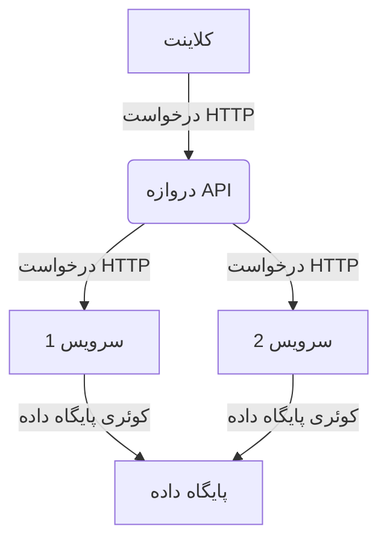

متوجه شدم. حق با شماست، لحن باید طبیعی‌تر و به فارسی روان‌تر باشه. الان ترجمه رو با این رویکرد انجام میدم:

# 🤖 پرامپت‌های ChatGPT برای توسعه‌دهندگان

خوش اومدی به مجموعه شخصی من از پرامپت‌های ChatGPT برای توسعه‌دهندگان! 🙌

این ریپازیتوری شامل فهرستی از پرامپت‌های قدرتمند ChatGPT هست که میتونه به سرعت و خلاقیت شما کمک کنه. 💡 فرقی نمیکنه تازه‌کار باشی یا یه حرفه‌ای باتجربه، این پرامپت‌ها کمکت میکنن خلاقانه‌تر فکر کنی و راه‌حل‌های جدیدی برای مشکلات پیدا کنی. 🚀

این لیست به دسته‌های مختلف تقسیم شده: [پرامپت‌هایی برای برنامه‌نویس‌ها، دانشجوها، بازاریاب‌ها و تولیدکنندگان محتوا]. پس مهم نیست حرفه‌ت چیه، اینجا برای همه چیزی پیدا میشه! 😊 بیا با هم این پرامپت‌های قدرتمند رو بررسی کنیم که میتونن خلاقیت تو رو به سطح بالاتری ببرن! 🌊

## فهرست مطالب

پرامپت‌ها برای برنامه‌نویس‌ها

- [🚩 نکات](#-نکات)
- [🔗 رویکرد چند پرامپتی (زنجیره پرامپت)](#-رویکرد-چند-پرامپتی-زنجیره-پرامپت)
  - [1. مدرن‌سازی و افزودن بهترین روش‌ها](#1-مدرن‌سازی-و-افزودن-بهترین-روش‌ها)
  - [2. بررسی کد برای خطاهای منطقی و مشکلات امنیتی](#2-بررسی-کد-برای-خطاهای-منطقی-و-مشکلات-امنیتی)
  - [3. اعتبارسنجی توصیه‌ها (بازتاب)](#3-اعتبارسنجی-توصیه‌ها-بازتاب)
  - [4. نوشتن کد](#4-نوشتن-کد)
  - [5. ایجاد تست‌ها](#5-ایجاد-تست‌ها)
- [پرامپت بازنویسی](#پرامپت-بازنویسی)
- [بهینه‌ساز پرامپت ChatGPT](#بهینه‌ساز-پرامپت-chatgpt)
- [درخواست راه‌حل‌های جایگزین](#درخواست-راه‌حل‌های-جایگزین)
- [مستندسازی / توضیح](#مستندسازی--توضیح)
  - [📣 افزودن مستندات](#-افزودن-مستندات)
  - [📣 نوشتن قوانین و شرایط](#-نوشتن-قوانین-و-شرایط)
  - [📣 تولید راهنماهای سریع](#-تولید-راهنماهای-سریع)
  - [📣 تولید فایل‌های Readme](#-تولید-فایل‌های-readme)
  - [📣 نوشتن مقالات تخصصی](#-نوشتن-مقالات-تخصصی)
  - [📣 توضیح کد](#-توضیح-کد)
  - [📣 نمودار معماری (Mermaid)](#-نمودار-معماری-mermaid)
  - [📣 نمودار رابطه موجودیت (Mermaid)](#-نمودار-رابطه-موجودیت-mermaid)
- [بازسازی کد](#بازسازی-کد)
  - [📣 بازسازی کد](#-بازسازی-کد)
  - [📣 مدرن‌سازی کدهای قدیمی](#-مدرن‌سازی-کدهای-قدیمی)
  - [📣 تبدیل کد به چندین متد](#-تبدیل-کد-به-چندین-متد)
  - [📣 بهبود عملکرد](#-بهبود-عملکرد)
  - [📣 افزودن پارامتر به تابع](#-افزودن-پارامتر-به-تابع)
  - [📣 افزودن بهترین روش‌ها یا اصول کدنویسی](#-افزودن-بهترین-روش‌ها-یا-اصول-کدنویسی)
  - [📣 رعایت دستورالعمل‌های سبک کدنویسی](#-رعایت-دستورالعمل‌های-سبک-کدنویسی)
  - [📣 تشخیص و رفع خطاها](#-تشخیص-و-رفع-خطاها)
  - [📣 دیباگ کامپوننت React](#-دیباگ-کامپوننت-react)
  - [📣 ایجاد تست‌های واحد](#-ایجاد-تست‌های-واحد)
  - [📣 ترجمه کد](#-ترجمه-کد)
  - [📣 طراحی واکنشگرا](#-طراحی-واکنشگرا)
  - [📣 بین‌المللی‌سازی](#-بین‌المللی‌سازی)
  - [📣 افزودن توضیحات به کد](#-افزودن-توضیحات-به-کد)
- [تولید کد](#تولید-کد)
  - [📣 ایجاد توابع](#-ایجاد-توابع)
  - [📣 تولید یک Dockerfile](#-تولید-یک-dockerfile)
  - [📣 نوشتن عبارت منظم (RegEx)](#-نوشتن-عبارت-منظم-regex)
  - [📣 ایجاد یک کلاس](#-ایجاد-یک-کلاس)
  - [📣 افزودن قابلیت](#-افزودن-قابلیت)
  - [📣 ایجاد کد پایه](#-ایجاد-کد-پایه)
  - [📣 تو یک مهندس نرم‌افزار سطح جهانی هستی](#-تو-یک-مهندس-نرم‌افزار-سطح-جهانی-هستی)
- [بررسی کد](#بررسی-کد)
  - [📣 مدیریت خطا](#-مدیریت-خطا)
  - [📣 پیشنهاد بهبودها](#-پیشنهاد-بهبودها)
- [تبلیغ محصول و خدمات](#تبلیغ-محصول-و-خدمات)
  - [📣 تولید ایده‌های محصول نوآورانه](#-تولید-ایده‌های-محصول-نوآورانه)
  - [📣 توسعه ارزش پیشنهادی منحصربفرد](#-توسعه-ارزش-پیشنهادی-منحصربفرد)
  - [📣 تسلط بر هنر داستان‌سرایی برای بازاریابی](#-تسلط-بر-هنر-داستان‌سرایی-برای-بازاریابی)
  - [📣 ایجاد یک برنامه ارجاع موفق](#-ایجاد-یک-برنامه-ارجاع-موفق)
  - [📣 تسلط بر هنر فروش بالاتر و فروش متقاطع](#-تسلط-بر-هنر-فروش-بالاتر-و-فروش-متقاطع)
  - [📣 ایجاد یک کمپین بازاریابی ویروسی](#-ایجاد-یک-کمپین-بازاریابی-ویروسی)
  - [📣 توسعه یک معرفی کوتاه و قدرتمند](#-توسعه-یک-معرفی-کوتاه-و-قدرتمند)
  - [📣 ایجاد یک برنامه بازاریابی قابل اجرا](#-ایجاد-یک-برنامه-بازاریابی-قابل-اجرا)
  - [📣 استفاده از بازاریابی محتوا برای تولید لید](#-استفاده-از-بازاریابی-محتوا-برای-تولید-لید)

## 🚩 نکات

مثل خیلی چیزای دیگه تو زندگی، با GPT-4 هرچی بیشتر وقت بذاری، نتیجه بهتری میگیری. در این مورد، ارائه زمینه، دستورالعمل و راهنمایی بیشتر معمولاً نتایج بهتری تولید میکنه.

اینجا چند تا نکته و تکنیک برای بهبود نتایج هست:

- **پرامپت‌ها رو تقسیم کن:**
سعی کن پرامپت‌ها و نتیجه مورد نظرت رو به چند مرحله تقسیم کنی. پرامپت‌هایی که فقط یک هدف دارن معمولاً نتایج بهتری نسبت به پرامپت‌های ترکیبی تولید میکنن. مثلاً، اول درخواست بررسی بده، بعد بر اساس پاسخ بررسی، درخواست بازسازی کن. با افزایش محدودیت توکن مدل‌های زبانی، این موضوع ممکنه کم‌اهمیت‌تر بشه.

- **مثال بده:**
ورودی‌ها، داده‌ها و خروجی‌های مورد انتظار رو ارائه بده تا دقت و کیفیت بهتر بشه. 📝

- **دقیق باش:**
نترس از اینکه دقیقاً بگی چی میخوای، چی میدونی، چه چیزی لازمه و چه چیزی نباید شامل بشه. 🔎

- **ازش بخواه تأمل کنه:**
تکنیکی به نام "بازتاب" نشون داده که دقت GPT-4 رو افزایش میده. اساساً ازش بپرس "چرا اشتباه کردی؟" یا ازش بخواه پاسخ خودش رو بررسی و ارزیابی کنه. 🤔

## 🔗 رویکرد چند پرامپتی (زنجیره پرامپت)

میشه از این روش برای به‌روزرسانی، بازسازی و بررسی یک قطعه کد استفاده کرد. یه مجموعه پرامپت خوب طراحی شده، مجموعه‌ای هست که هر کدوم دغدغه‌های جداگانه و مسئولیت‌های مشخصی دارن.

### 1. مدرن‌سازی و افزودن بهترین روش‌ها

---

با درخواست از GPT-4 برای بازنویسی کدت به سبک مورد نظرت. این مرحله معمولاً منجر به خروجی منسجم با سبک مورد نظرت میشه، اما ممکنه خطاهایی رو معرفی کنه، پس اول این کار رو انجام میدیم.

**پرامپت:**

```
کد زیر رو بررسی کن و اون رو با استانداردهای برنامه‌نویسی مدرن es6 و قالب‌بندی بازنویسی کن:

[کد رو اینجا قرار بده]
```

### 2. بررسی کد برای خطاهای منطقی و مشکلات امنیتی

---

توصیه‌هایی برای بهبود هر گونه مشکل منطقی یا امنیتی معرفی شده بگیر. مهمه که درخواست بازسازی نکنی، فقط دلایل پشت درخواست بازسازی رو بخواه.

**پرامپت:**

```
کد ارائه شده 'tempFunction' رو برای هر گونه مشکل منطقی یا امنیتی بررسی کن و فهرستی از توصیه‌ها ارائه بده.
```

### 3. اعتبارسنجی توصیه‌ها (بازتاب)

---

توصیه‌های ارائه شده رو اعتبارسنجی کن. بازتاب یک تکنیک قدرتمند برای بهبود دقت توصیه‌های اولیه و تلاش برای حذف هر گونه توهم هست. این همیشه لازم نیست اما اگه در مورد توصیه‌ها مطمئن نیستی، ارزش پرسیدن رو داره.

**پرامپت:**

```
توصیه‌های بالا رو بررسی کن. بهم بگو چرا اشتباه کردی و آیا توصیه‌هایی بودن که نادیده گرفته شدن یا به اشتباه اضافه شدن؟
```

### 4. نوشتن کد

---

بررسی‌ها، توصیه‌ها و بازخوردهات رو ترکیب کن تا GPT-4 تابع جدیدت رو بنویسه.

**پرامپت:**

```
تابع 'tempFunction' رو بر اساس بررسی و توصیه‌های خودت بازنویسی کن.
```

### 5. ایجاد تست‌ها

---

چند تا تست ساده بساز که بتونیم به صورت محلی اجرا کنیم و نتایج رو تأیید کنیم.

**پرامپت:**

```
دو تست [فناوری رو تعریف کن] برای تابع 'tempFunction' بالا بساز. یکی که انتظار داری موفق بشه و یکی که انتظار داری شکست بخوره.
```

## پرامپت بازنویسی

ببینیم میتونیم GPT4 رو وادار کنیم پرامپت‌های معمولی رو به پرامپت‌های "سفر الهام‌بخش" تبدیل کنه.

**پرامپت:**

```
[پرامپت خودت]

متن بالا رو طوری بازنویسی کن که پرحرف‌تر باشه و توصیفات زیادی درباره هر چیز داشته باشه، از زبان تصویری استفاده کن.
```

<sup>[⬆️ بازگشت به فهرست مطالب](#فهرست-مطالب)</sup>

## بهینه‌ساز پرامپت ChatGPT

**پرامپت:**

```
من یه پرامپت ChatGPT میدم. تو باید سوالاتی بپرسی تا مخاطب و اهداف رو بفهمی، بعد با استفاده از اصل اختصاصی‌سازی، پرامپت رو برای اثربخشی و مرتبط بودن بهینه کنی.
```

<sup>[⬆️ بازگشت به فهرست مطالب](#فهرست-مطالب)</sup>

## درخواست راه‌حل‌های جایگزین

اگه از راه‌حلت راضی نیستی میتونی از ChatGPT بخوای راه‌حل‌های جایگزین بهت بده

**پرامپت:**

```
من یه قطعه کد که خودم نوشتم رو بهت میدم و
میخوام راه‌های دیگه‌ای برای انجام همون کار بهم بدی:

[کد خودت رو اینجا قرار بده]
```

<sup>[⬆️ بازگشت به فهرست مطالب](#فهرست-مطالب)</sup>

---

## مستندسازی / توضیح

### 📣 افزودن مستندات

> [!NOTE]
> افزودن مستندات نیاز به ایجاد توضیحات روشن و جامع از هدف، طراحی و پیاده‌سازی یک ماژول داره.

پرامپت 1#:

```
من برنامه‌نویسی بلد نیستم، اما میخوام بفهمم این کد چطور کار میکنه. کد زیر رو برام طوری توضیح بده که یه فرد غیرفنی بتونه بفهمه. همیشه از مارک‌داون با قالب‌بندی خوب استفاده کن تا دنبال کردنش راحت‌تر باشه. اون رو با بخش‌هایی با عنوان سازماندهی کن. در هر بخش به کد به صورت بلوک‌های کد مارک‌داون اشاره کن. کد:

[کد رو اینجا قرار بده]
```

پرامپت 2#:

```
لطفاً مستندات جامعی برای [نام فایل یا ماژول] اضافه کن، شامل توضیحات واضح و مختصر از هدف، طراحی و پیاده‌سازی اون. به مثال‌هایی از نحوه استفاده از ماژول و همچنین نمودارها یا فلوچارت‌های مرتبط برای کمک به توضیح عملکرد اون فکر کن. اطمینان حاصل کن که مستندات برای سایر توسعه‌دهندگان به راحتی قابل دسترسی باشه و با تکامل ماژول به‌روز بشه. برای ساده‌تر کردن فرآیند، استفاده از ابزارهای مستندسازی مثل توضیحات درون‌خطی، فایل‌های مارک‌داون یا یک تولیدکننده مستندات رو در نظر بگیر.

[کد رو اینجا قرار بده]
```

<sup>[⬆️ بازگشت به فهرست مطالب](#فهرست-مطالب)</sup>

### 📣 نوشتن قوانین و شرایط

**پرامپت:**

```
برای وبسایت من درباره یک [ابزار هوش مصنوعی] به نام [نام] قوانین و شرایط استفاده بنویس.
```

<sup>[⬆️ بازگشت به فهرست مطالب](#فهرست-مطالب)</sup>

### 📣 تولید راهنماهای سریع

**پرامپت:**

```
یک راهنمای سریع برای [قالب‌بندی مارک‌داون] بنویس.
```

<sup>[⬆️ بازگشت به فهرست مطالب](#فهرست-مطالب)</sup>

### 📣 تولید فایل‌های Readme

**پرامپت:**

```
برای کد زیر مستندات تولید کن. باید دستورالعمل‌های دقیقی برای اجرای اون روی یک کامپیوتر محلی توسط یک توسعه‌دهنده، توضیح اینکه کد چه کاری انجام میده و فهرست آسیب‌پذیری‌های موجود در این کد رو شامل بشه.

[کد رو وارد کن]
```

<sup>[⬆️ بازگشت به فهرست مطالب](#فهرست-مطالب)</sup>

### 📣 نوشتن مقالات تخصصی

**پرامپت:**

```
یک مقاله تخصصی درباره چگونگی ساخت یک [ردیاب کووید] با استفاده از React با ساختار مناسب کد بنویس.
```

<sup>[⬆️ بازگشت به فهرست مطالب](#فهرست-مطالب)</sup>

### 📣 توضیح کد

> [!NOTE]
> وقتت رو برای فهمیدن نحوه کار کد تلف نکن، فقط از ChatGPT بخواه برات توضیح بده

**پرامپت:**

```
زمینه: من یه پوزیشن جدید به عنوان توسعه‌دهنده بک‌اند شروع کردم و باید بفهمم بعضی از توابع چطور کار می‌کنن
فناوری‌ها: [فناوری‌هات رو اینجا وارد کن]
وظیفه تو: کد رو خط به خط برام توضیح بده

[کدت رو اینجا قرار بده]
```

<sup>[⬆️ بازگشت به فهرست مطالب](#فهرست-مطالب)</sup>

### 📣 نمودار معماری (Mermaid)

> [!NOTE]
> با استفاده از Mermaid یک نمودار از معماری‌ت بساز

**پرامپت:**

```
کد Mermaid برای یک نمودار معماری برای این راه‌حل بنویس [راه‌حل رو توصیف کن]
```

مثال:



<sup>[⬆️ بازگشت به فهرست مطالب](#فهرست-مطالب)</sup>

### 📣 نمودار رابطه موجودیت (Mermaid)

> [!NOTE]
> با استفاده از Mermaid یک نمودار رابطه موجودیت بساز

**پرامپت:**

```
کد Mermaid برای یک نمودار رابطه موجودیت برای این کلاس‌ها بنویس [کلاس‌ها رو وارد کن]
```

<sup>[⬆️ بازگشت به فهرست مطالب](#فهرست-مطالب)</sup>

## بازسازی کد

### 📣 بازسازی کد

> [!NOTE]
> از ChatGPT بخواه کدت رو بازسازی کنه

**پرامپت:**

```
من یه قطعه کد دارم و میخوام بازسازیش کنی:

[کدت رو اینجا قرار بده]
```

بازسازی کد یک فرآیند ضروری در توسعه نرم‌افزار هست که هدفش بهبود کیفیت، خوانایی و نگهداری کد موجود بدون تغییر عملکرد اون هست. بازسازی میتونه کارایی کد رو بهبود بده، خطاها رو کاهش بده و اصلاح یا گسترش اون رو در آینده آسون‌تر کنه. با کمک ChatGPT، میتونی به طور مؤثر کدت رو بازسازی کنی و به ساختار کد بهتری برسی.

<sup>[⬆️ بازگشت به فهرست مطالب](#فهرست-مطالب)</sup>

### 📣 مدرن‌سازی کدهای قدیمی

> [!NOTE]
> با ارائه تابع قدیمی خودت به GPT-4 و درخواست بازسازی اون به شیوه‌های کدنویسی مدرن، میتونی به سرعت کدت رو مدرن کنی.

**پرامپت:**

```
کد زیر رو به استانداردهای برنامه‌نویسی مدرن es6 بازسازی کن:

[کدت رو اینجا قرار بده]
```

<sup>[⬆️ بازگشت به فهرست مطالب](#فهرست-مطالب)</sup>

### 📣 تبدیل کد به چندین متد

> [!NOTE]
> اگه یه تابع طولانی داری که کارهای زیادی انجام میده، میتونی از GPT-4 بخوای اون رو به چند متد تبدیل کنه.

**پرامپت:**

```
کد زیر رو به چندین متد تبدیل کن تا خوانایی و قابلیت نگهداری بهتر بشه:

[کدت رو اینجا قرار بده]
```

<sup>[⬆️ بازگشت به فهرست مطالب](#فهرست-مطالب)</sup>

### 📣 بهبود عملکرد

> [!NOTE]
> اگه یه تابع داری که اجراش زمان زیادی میبره، میتونی از GPT-4 بخوای اون رو برای بهبود عملکرد بازسازی کنه.

**پرامپت:**

```
کد زیر رو برای بهبود عملکرد بازسازی کن:

[کدت رو اینجا قرار بده]
```

<sup>[⬆️ بازگشت به فهرست مطالب](#فهرست-مطالب)</sup>

### 📣 افزودن پارامتر به تابع

**پرامپت:**

```
یه پارامتر به این تابع اضافه کن تا [قابلیت] رو انجام بده

[کدت رو اینجا قرار بده]
```

<sup>[⬆️ بازگشت به فهرست مطالب](#فهرست-مطالب)</sup>

### 📣 افزودن بهترین روش‌ها یا اصول کدنویسی

> [!NOTE]
> بذار ChatGPT کد رو مطابق با دستورالعمل‌های سبک برات بازنویسی کنه.

**پرامپت:**

```
کد زیر رو با رعایت دستورالعمل‌های سبک Google برای جاوااسکریپت بازنویسی کن.

[کدت رو اینجا قرار بده]
```

<sup>[⬆️ بازگشت به فهرست مطالب](#فهرست-مطالب)</sup>

### 📣 رعایت دستورالعمل‌های سبک کدنویسی

> [!NOTE]
> اگه سازمان یا کد پایه تو از شیوه‌ها و سبک‌های کدنویسی خاصی استفاده میکنه که میخوای حفظ کنی، میتونی به GPT-4 دستور بدی که روی کدوم شیوه یا سبک کدنویسی خاص تمرکز کنه.

**پرامپت:**

```
کد زیر رو بررسی کن و اون رو بازسازی کن تا DRY‌تر بشه و اصول برنامه‌نویسی SOLID رو رعایت کنه.

[کدت رو اینجا قرار بده]
```

<sup>[⬆️ بازگشت به فهرست مطالب](#فهرست-مطالب)</sup>

### 📣 تشخیص و رفع خطاها

> [!NOTE]
> گاهی اوقات از آسیب‌پذیری‌ها یا مشکلات احتمالی که کدمون میتونه ایجاد کنه بی‌خبریم. بررسی و رفع مشکلات کد توسط GPT-4 میتونه بیشتر از فقط وقت برات صرفه‌جویی کنه.

**پرامپت 1#:**

```
این کد رو برای خطاها بررسی کن و برای رفع هر مشکلی بازسازی کن:

[کدت رو اینجا قرار بده]
```

**پرامپت 2#:**

```
من دارم نرم‌افزاری با [فناوری‌هات رو اینجا وارد کن] توسعه میدم و میخوام کمکم کنی
تمام خطاها رو در کدم پیدا و رفع کنی، با رعایت بهترین روش‌ها. کدم رو بهت میدم
و تو باید کد رو با تمام اصلاحات توضیح داده شده خط به خط بهم بدی
```

**پرامپت 3#:**

```
من این کد رو نوشتم [کد] این خطا رو گرفتم [خطا] چطور میتونم درستش کنم؟ یا این خطا به چه معنیه؟
```

<sup>[⬆️ بازگشت به فهرست مطالب](#فهرست-مطالب)</sup>

### 📣 دیباگ کامپوننت React

> [!NOTE]
> این فرآیند معمولاً شامل شناسایی منبع خطا، درک مشکل و پیاده‌سازی راه‌حلی برای رفع مشکل هست

**پرامپت:**

```
لطفاً باگ در کامپوننت [نام کامپوننت] رو که باعث [مشکل رو توصیف کن] میشه پیدا و رفع کن.

[کدت رو اینجا قرار بده]
```

<sup>[⬆️ بازگشت به فهرست مطالب](#فهرست-مطالب)</sup>

### 📣 ایجاد تست‌های واحد

> [!NOTE]
> تست‌های واحد، تست‌های خودکاری هستن که رفتار واحدهای مجزای کد رو در انزوا بررسی می‌کنن. اونا کمک می‌کنن باگ‌ها رو زودتر پیدا کنی و نگهداری کد رو آسون‌تر کنن.

**پرامپت 1#:**

```
لطفاً تست‌های واحد برای [نام فایل یا ماژول] بنویس تا از عملکرد صحیح اون اطمینان حاصل بشه

[کد رو اینجا قرار بده]
```

**پرامپت 2#:**

```
برای کد ارائه شده 2 تا تست واحد بنویس. یکی برای شرایط موفق و یکی برای شکست.
```

<sup>[⬆️ بازگشت به فهرست مطالب](#فهرست-مطالب)</sup>

### 📣 ترجمه کد

> [!NOTE]
> دلایل زیادی وجود داره که ممکنه نیاز داشته باشی کد رو از یک زبان به زبان دیگه تبدیل کنی. مثلاً، ممکنه یه مخزن با کدی برای یک زبان پیدا کرده باشی که به زبان دیگه‌ای نیاز داری، در حال انتقال کد پایه هستی، یا شاید رئیست یه مقاله درباره آخرین فریمورک فرانت‌اند خونده و حالا داری به یک کتابخانه جدید و بحث‌برانگیز منتقل میشی.

**پرامپت:**

```
کد زیر رو به زبان Rust بازنویسی کن:

[کدت رو اینجا قرار بده]
```

<sup>[⬆️ بازگشت به فهرست مطالب](#فهرست-مطالب)</sup>

### 📣 طراحی واکنشگرا

> [!NOTE]
> طراحی واکنشگرا یک وبسایت رو با اندازه‌های مختلف صفحه و دستگاه‌ها سازگار می‌کنه و از طرح‌های انعطاف‌پذیر، تصاویر و کوئری‌های رسانه‌ای CSS استفاده می‌کنه. هدفش ارائه تجربه مشاهده خوب برای همه کاربران هست

**پرامپت:**

```
لطفاً طراحی واکنشگرا برای کامپوننت [نام کامپوننت] پیاده‌سازی کن تا اطمینان حاصل بشه که در اندازه‌های مختلف صفحه و دستگاه‌ها به درستی نمایش داده میشه و کار می‌کنه. از [تکنیک یا کتابخانه طراحی واکنشگرا] برای دستیابی به این هدف استفاده کن.

[کد رو اینجا قرار بده]
```

<sup>[⬆️ بازگشت به فهرست مطالب](#فهرست-مطالب)</sup>

### 📣 بین‌المللی‌سازی

> [!NOTE]
> بین‌المللی‌سازی، که به عنوان i18n هم شناخته میشه، فرآیند طراحی یک نرم‌افزار به گونه‌ای هست که بتونه از چندین زبان و تفاوت‌های منطقه‌ای پشتیبانی کنه

**پرامپت:**

```
لطفاً بین‌المللی‌سازی برای کامپوننت [نام کامپوننت] پیاده‌سازی کن تا اطمینان حاصل بشه که کاربران در چندین زبان می‌تونن از اون استفاده کنن. برای دستیابی به این هدف، استفاده از [کتابخانه یا تکنیک بین‌المللی‌سازی] رو در نظر بگیر.
```

<sup>[⬆️ بازگشت به فهرست مطالب](#فهرست-مطالب)</sup>

### 📣 افزودن توضیحات به کد

> [!NOTE]
> اگه کدت خودتوضیح هست اما نیاز به توضیح داره، این میتونه صرفه‌جویی بزرگی در وقت باشه.

**پرامپت:**

```
به کد زیر توضیحات اضافه کن:

[کدت رو اینجا قرار بده]
```

<sup>[⬆️ بازگشت به فهرست مطالب](#فهرست-مطالب)</sup>

## تولید کد

### 📣 ایجاد توابع

> [!NOTE]
> زمینه نرم‌افزارت رو ارائه بده و مستقیماً درخواست ایجاد توابع مورد نیاز برای نرم‌افزارت رو بکن

**پرامپت:**

```
زمینه: من دارم یه نرم‌افزار برای مدیریت پروژه‌ها میسازم

فناوری‌ها: Go، PostgreSQL

توضیحات: یه تابع که به من اجازه میده کاربران رو با ایمیل یا نام کاربریشون پیدا کنم.

وظیفه تو: این تابع رو برام بساز
```

همچنین میتونی در توضیحات بگی که از تابعت انتظار داری چی دریافت کنی. اگه قبلاً یه ساختار برای کاربر داری، اون رو مشخص کن، مثلاً:

**پرامپت:**

```
زمینه: من دارم یه نرم‌افزار برای مدیریت پروژه‌ها میسازم

فناوری‌ها: Go، PostgreSQL

توضیحات: یه تابع که به من اجازه میده کاربران رو با ایمیل یا نام کاربریشون پیدا کنم و ساختار نوع "Member" رو برگردونه

وظیفه تو: این تابع رو برام بساز
```

<sup>[⬆️ بازگشت به فهرست مطالب](#فهرست-مطالب)</sup>

### 📣 تولید یک Dockerfile

> [!NOTE]
> یک پرامپت برای تولید یک Dockerfile برای یک فریمورک خاص.

**پرامپت:**

```
یک Dockerfile برای این بنویس:

[فریمورک]
```

<sup>[⬆️ بازگشت به فهرست مطالب](#فهرست-مطالب)</sup>

### 📣 نوشتن عبارت منظم (RegEx)

**پرامپت:**

```
یک عبارت منظم بنویس که با این مطابقت داشته باشه / یک الگوی RegEx برای این بنویس:

[درخواست]
```

<sup>[⬆️ بازگشت به فهرست مطالب](#فهرست-مطالب)</sup>

### 📣 ایجاد یک کلاس

**پرامپت:**

```
یک کلاس [پلتفرم] از این آبجکت JSON بساز

[JSON]
```

<sup>[⬆️ بازگشت به فهرست مطالب](#فهرست-مطالب)</sup>

### 📣 افزودن قابلیت

**پرامپت:**

```
من یه قطعه کد در [فناوری‌هات رو اینجا وارد کن] نیاز دارم که [ارتباط بلادرنگ] رو پیاده‌سازی کنه
```

<sup>[⬆️ بازگشت به فهرست مطالب](#فهرست-مطالب)</sup>

### 📣 ایجاد کد پایه

> [!NOTE]
> شروع پروژه‌های جدید میتونه دردناک باشه. اگرچه GPT-4 منطق کسب و کار تو رو نمیدونه، اما میشه از اون برای تولید کد پایه استفاده کرد. این دقیقاً بازسازی نیست، اما شگفت‌انگیزه و میتونه بخشی از فرآیند چرخه زندگی برنامه‌نویسی باشه.

**پرامپت:**

```
یه تابع پایه Node.js برام بنویس که یه متغیر از نوع User رو بگیره، تأیید کنه که کاربر مجوزهای درست رو داره، یه آرایه از آیتم‌های نوع Posts از یه پایگاه داده postgres بگیره و اونها رو برگردونه. برای منطق کسب و کار توضیح بذار.
```

<sup>[⬆️ بازگشت به فهرست مطالب](#فهرست-مطالب)</sup>

### 📣 تو یک مهندس نرم‌افزار سطح جهانی هستی

> [!NOTE]
> در این کلیپ نشون میدم چطور خروجی‌های ChatGPT رو برای تولید نرم‌افزار *به شدت* بهبود بدی.

**پرامپت:**

```
تو یک مهندس نرم‌افزار سطح جهانی هستی.

من نیاز دارم یک مشخصات فنی نرم‌افزار برای ساخت موارد زیر تهیه کنی:
[ توضیحات ]

قدم به قدم فکر کن چطور اون رو بسازی.

بعد، با مشخصات کامل به صورت یک فایل مارک‌داون سازماندهی شده پاسخ بده.

من بعداً با "بساز" پاسخ میدم، و تو باید شروع کنی به پیاده‌سازی مشخصات دقیق، و تمام کدهای مورد نیاز رو بنویسی. من گاهی با "ادامه بده" میپرم وسط تا ازت بخوام ادامه بدی. تا تکمیل شدن ادامه بده.
```

<sup>[⬆️ بازگشت به فهرست مطالب](#فهرست-مطالب)</sup>

## بررسی کد

### 📣 مدیریت خطا

**پرامپت:**

```
چطور میتونم مدیریت خطا رو در کد [زبان] خودم بهبود بدم؟ [کد]
```

<sup>[⬆️ بازگشت به فهرست مطالب](#فهرست-مطالب)</sup>

### 📣 پیشنهاد بهبودها

**پرامپت:**

```
من روی یک پروژه [زبان] کار میکنم و نیاز دارم کدم رو بررسی کنی و بهبودهایی پیشنهاد بدی. [کد]
```

<sup>[⬆️ بازگشت به فهرست مطالب](#فهرست-مطالب)</sup>


## تبلیغ محصول و خدمات

### 📣 تولید ایده‌های محصول نوآورانه

**پرامپت:**

```
ایده‌های محصول خلاقانه و منحصر به فرد برای [صنعت یا بازار مورد نظر] ارائه بده.

روی حل نقاط درد مشتری و ارائه ارزش استثنایی تمرکز کن.
```

<sup>[⬆️ بازگشت به فهرست مطالب](#فهرست-مطالب)</sup>

### 📣 توسعه ارزش پیشنهادی منحصربفرد

**پرامپت:**

```
کمکم کن یک ارزش پیشنهادی منحصربفرد برای [محصول یا خدمت من] بیان کنم.

توضیح بده چطور این پیشنهاد محصول من رو متمایز میکنه و برای مخاطب هدف من جذاب هست.
```

<sup>[⬆️ بازگشت به فهرست مطالب](#فهرست-مطالب)</sup>

### 📣 تسلط بر هنر داستان‌سرایی برای بازاریابی

**پرامپت:**

```
تکنیک‌های داستان‌سرایی برای ایجاد محتوای بازاریابی جذاب برای تبلیغ [محصول یا خدمت] رو بهم یاد بده.
```

<sup>[⬆️ بازگشت به فهرست مطالب](#فهرست-مطالب)</sup>

### 📣 ایجاد یک برنامه ارجاع موفق

**پرامپت:**

```
یک برنامه ارجاع برای [کسب و کار] طراحی کن که مشتریان رو تشویق کنه محصولات یا خدمات ما رو به اشتراک بذارن و پیشنهاد بدن.
```

<sup>[⬆️ بازگشت به فهرست مطالب](#فهرست-مطالب)</sup>

### 📣 تسلط بر هنر فروش بالاتر و فروش متقاطع

**پرامپت:**

```
تکنیک‌های مؤثر فروش بالاتر و فروش متقاطع رو برای افزایش درآمد و رضایت مشتری در [زمینه کسب و کار] بهم یاد بده.
```

<sup>[⬆️ بازگشت به فهرست مطالب](#فهرست-مطالب)</sup>

### 📣 ایجاد یک کمپین بازاریابی ویروسی

**پرامپت:**

```
یک کمپین بازاریابی خلاقانه و جلب توجه کننده برای [محصول یا خدمت] با پتانسیل ویروسی شدن طراحی کن.
```

<sup>[⬆️ بازگشت به فهرست مطالب](#فهرست-مطالب)</sup>

### 📣 توسعه یک معرفی کوتاه و قدرتمند

**پرامپت:**

```
[یک توضیح مختصر از محصول، خدمت یا شرکت خودت].

کمکم کن یک معرفی کوتاه و قدرتمند بسازم که به طور مؤثر ارزش پیشنهادی من رو منتقل کنه.
```

<sup>[⬆️ بازگشت به فهرست مطالب](#فهرست-مطالب)</sup>

### 📣 ایجاد یک برنامه بازاریابی قابل اجرا

**پرامپت:**

```
یک برنامه بازاریابی برای [محصول یا خدمت] توسعه بده.

اهداف، مخاطب هدف، کانال‌های بازاریابی و تاکتیک‌هایی برای رسیدن به مخاطب مورد نظر و افزایش فروش رو شامل کن.
```

<sup>[⬆️ بازگشت به فهرست مطالب](#فهرست-مطالب)</sup>

### 📣 استفاده از بازاریابی محتوا برای تولید لید

**پرامپت:**

```
یک استراتژی بازاریابی محتوا برای [کسب و کار] توسعه بده تا لیدها رو جذب، درگیر و به مشتری تبدیل کنه.
```

<sup>[⬆️ بازگشت به فهرست مطالب](#فهرست-مطالب)</sup>

<details>

<summary>

## 📚 ابزارها

</summary>

- [ChatGPT](https://chat.openai.com/)
- [Bard](https://bard.google.com/)

</details>
